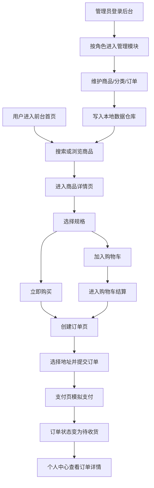

## 1. 产品概述
本项目为基于 React 18 + Vite 构建的前后台一体化电商商城，覆盖前台用户购物全流程与后台商品、分类、订单、权限管理。
- 面向课程作业场景，重点展示 React 组件化开发、路由隔离、权限控制、Mock 数据管理与 localStorage 持久化能力。
- 通过前后台共享同一套本地数据仓库，实现商品、分类、订单、用户数据的实时联动，满足完整业务闭环演示。

## 2. 核心功能

### 2.1 用户角色
| 角色 | 注册方式 | 核心权限 |
|------|----------|----------|
| 普通用户 | 前台注册 | 浏览商品、加入购物车、下单、支付、查看订单、管理地址 |
| 超级管理员 | 预置管理员账号登录 | 访问全部后台模块，管理商品、分类、订单、角色与管理员 |
| 普通运营 | 预置管理员账号登录 | 仅访问被授权后台模块，查看并处理订单、部分商品信息 |

### 2.2 功能模块
1. **前台首页**：顶部搜索、轮播图、热门商品、推荐分类入口。
2. **前台分类页**：分类索引、分类筛选、商品列表分页、关键词过滤。
3. **商品详情页**：商品图文、价格、规格选择、加入购物车、立即购买。
4. **购物车页**：购物车列表、数量修改、单条删除、全选删除、结算。
5. **创建订单页**：地址选择、商品清单确认、金额汇总、提交订单。
6. **支付页**：模拟支付宝支付、支付状态提示、支付完成流转。
7. **订单详情页**：订单基础信息、状态、商品列表、金额、地址信息。
8. **个人中心页**：登录用户信息、订单分类、地址管理、订单分页。
9. **前台登录注册页**：独立登录与注册表单、校验提示、登录态持久化。
10. **后台登录页**：管理员登录、角色权限识别、后台入口拦截。
11. **后台商品管理页**：商品列表分页、新增、编辑、删除、上下架。
12. **后台分类管理页**：分类增删改查、状态展示。
13. **后台订单管理页**：订单列表、状态变更、模拟发货。
14. **后台权限管理页**：角色说明、模块权限展示、管理员账号查看。

### 2.3 页面详情
| 页面名称 | 模块名称 | 功能描述 |
|-----------|-------------|---------------------|
| 前台首页 | 顶部搜索区 | 输入关键词后跳转商品列表并按关键词筛选 |
| 前台首页 | 轮播图 | 自动轮播商城主视觉图，展示商城活动信息 |
| 前台首页 | 热门商品 | 展示在售热门商品卡片，支持进入详情 |
| 分类页 | 分类侧栏/标签 | 展示全部分类并切换当前分类 |
| 分类页 | 商品列表 | 按分类与关键词筛选商品，支持分页 |
| 商品详情页 | 规格选择 | 选择颜色、容量等规格后购买或加购 |
| 购物车页 | 购物车列表 | 修改数量、选择商品、删除商品、统计总额 |
| 订单创建页 | 地址选择 | 从地址簿中选择收货地址并确认订单 |
| 支付页 | 支付卡片 | 模拟支付宝支付流程，显示支付中与支付成功状态 |
| 订单详情页 | 订单信息区 | 展示订单编号、状态、时间、金额、地址、商品明细 |
| 我的页面 | 用户信息卡 | 展示当前登录用户与账户摘要 |
| 我的页面 | 订单标签页 | 按全部/待付款/待收货查看订单 |
| 我的页面 | 地址管理 | 新增、编辑、删除地址并设置默认地址 |
| 前台登录注册页 | 登录表单 | 账号密码登录，表单校验与错误提示 |
| 前台登录注册页 | 注册表单 | 用户注册，校验用户名、手机号、密码与确认密码 |
| 后台登录页 | 管理员登录表单 | 根据账号密码登录后台并写入角色信息 |
| 商品管理页 | 商品表格 | 查询商品、新增编辑商品、删除、上下架 |
| 分类管理页 | 分类表格 | 新增编辑分类、删除分类、展示商品数量 |
| 订单管理页 | 订单表格 | 修改订单状态、模拟发货、查看订单收货信息 |
| 权限管理页 | 角色权限卡片 | 展示角色与模块权限映射、管理员分配情况 |

## 3. 核心流程
普通用户进入首页后可搜索和浏览商品，进入详情页选择规格后加入购物车或直接购买；提交订单时需完成登录校验与地址选择，支付后生成待收货订单，可在个人中心查看全流程订单状态。
后台管理员通过独立登录页进入管理后台，根据角色权限访问对应模块；对商品、分类、订单的维护会写入统一数据仓库，前台读取同一数据源后实时反映更新结果。

## 4. 用户界面设计
### 4.1 设计风格
- 主色采用深蓝灰与金色点缀，突出商城与后台的专业感。
- 按钮采用圆角卡片风格，重点操作使用高对比色渐变按钮。
- 字体使用系统中文无衬线字体栈，标题强调层级，正文保证可读性。
- 前台采用顶部导航 + 卡片瀑布式内容区，后台采用侧边菜单 + 顶部工具栏布局。
- 图标采用 Ant Design 图标体系，保证一致性与开发效率。

### 4.2 页面设计概览
| 页面名称 | 模块名称 | UI 元素 |
|-----------|-------------|-------------|
| 前台首页 | 轮播与商品区 | 大图轮播、搜索栏、分类快捷入口、商品卡片网格 |
| 分类页 | 筛选区 | 左侧分类菜单、右侧筛选结果、分页器 |
| 商品详情页 | 详情主体 | 左图右文布局、规格按钮组、价格强调区 |
| 购物车页 | 购物清单 | 表格式列表、数量步进器、结算汇总侧栏 |
| 我的页面 | 用户中心 | 资料卡、标签页、地址列表、订单时间轴 |
| 后台登录页 | 登录卡片 | 居中卡片、品牌标题、角色说明提示 |
| 后台管理页 | 管理工作台 | 侧边导航、统计卡片、数据表格、弹窗表单 |

### 4.3 响应式说明
采用桌面优先设计，兼容常见 PC 分辨率；前台在较窄宽度下自动切换为上下布局，后台表格区域支持横向滚动，保证课程演示时在常规笔记本环境下稳定运行。
