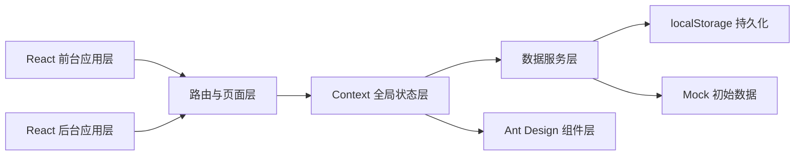
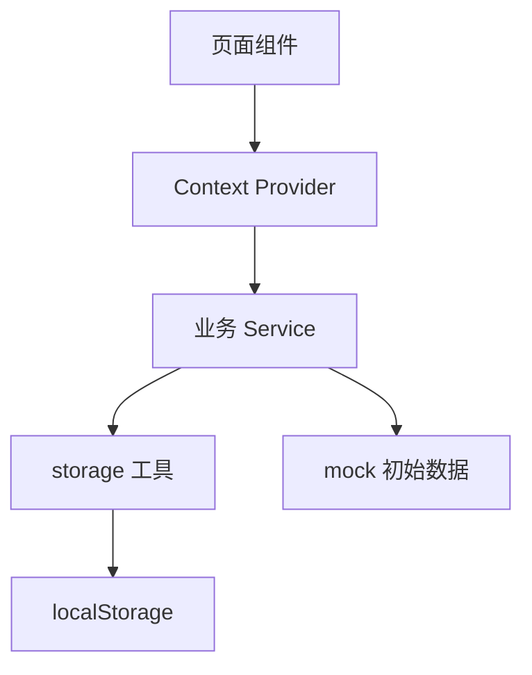
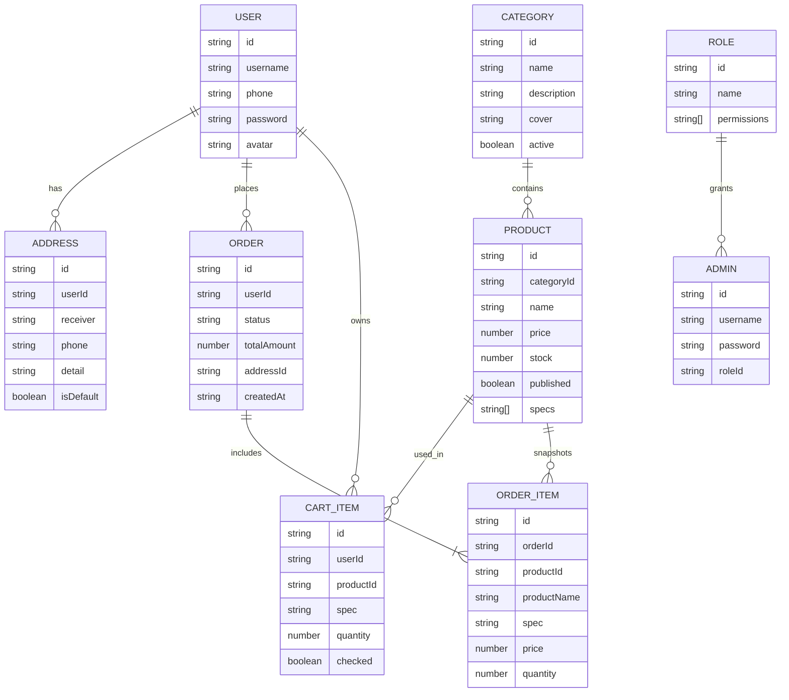

## 1. 架构设计



## 2. 技术说明

* 前端框架：React 18 + Vite 7

* 路由管理：React Router DOM v6，前台与后台使用独立路由树

* UI 组件：Ant Design 5 + @ant-design/icons

* 状态管理：React Context + 自定义 Hooks

* 数据方案：`src/mock` 提供初始化数据，`src/utils/storage` 负责 localStorage 读写与同步

* 表单校验：Ant Design Form Rules + 自定义校验函数

* 构建工具：Vite

## 3. 路由定义

| 路由                 | 用途         |
| ------------------ | ---------- |
| /                  | 前台首页       |
| /category          | 前台分类页      |
| /product/:id       | 商品详情页      |
| /cart              | 购物车页（需登录）  |
| /checkout          | 创建订单页（需登录） |
| /pay/:id           | 支付页（需登录）   |
| /order/:id         | 订单详情页（需登录） |
| /profile           | 个人中心（需登录）  |
| /login             | 前台登录/注册页   |
| /admin/login       | 后台登录页      |
| /admin             | 后台首页       |
| /admin/products    | 商品管理页      |
| /admin/categories  | 分类管理页      |
| /admin/orders      | 订单管理页      |
| /admin/permissions | 权限与角色页     |

## 4. API 定义（前端模拟服务）

本项目不接入真实后端，采用统一数据服务函数模拟接口调用。

```js
// 商品服务
getProducts(params)
getProductById(id)
createProduct(payload)
updateProduct(id, payload)
deleteProduct(id)
toggleProductStatus(id)

// 分类服务
getCategories()
createCategory(payload)
updateCategory(id, payload)
deleteCategory(id)

// 用户服务
loginUser(payload)
registerUser(payload)
getCurrentUser()
logoutUser()

// 购物车服务
getCartByUser(userId)
addCartItem(payload)
updateCartItem(payload)
removeCartItems(ids)
clearCheckedCartItems(userId)

// 订单服务
createOrder(payload)
getOrders(params)
getOrderDetail(id)
updateOrderStatus(id, status)
payOrder(id)
```

## 5. 服务架构图



## 6. 数据模型

### 6.1 数据模型定义



### 6.2 数据定义说明

* 首次运行时，从 `src/mock` 中加载商品、分类、用户、角色、管理员、订单基础数据到 localStorage。

* 所有业务模块统一通过数据服务层读写 `mall_products`、`mall_categories`、`mall_users`、`mall_orders`、`mall_cart_items`、`mall_addresses`、`mall_admins` 等键值。

* 订单创建时对商品信息进行快照存储，避免后台后续修改商品名称或价格导致历史订单数据失真。

* 后台角色权限通过 `permissions` 字段控制路由菜单与页面访问，不同角色只渲染授权模块。

